# Dinky

**Dinky** is a custom editor for **Ink** projects, which adds features specifically for [Dink](https://github.com/wildwinter/dink) ("Dialogue Ink") and adds IDs to every Ink line in the same way as [Ink-Localiser](https://github.com/wildwinter/Ink-Localiser/).

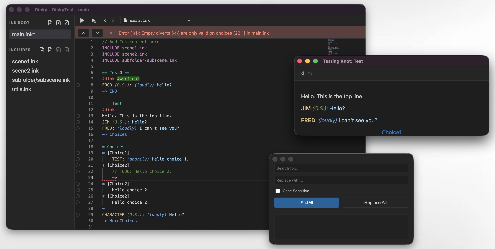

## Contents

- [Key Features](#key-features)
- [The ID format](#the-id-format)
- [Getting Started](#getting-started)
- [Scratch Audio](#scratch-audio)
- [Releases](#releases)
- [Acknowledgements](#acknowledgements)
- [License and Attribution](#license-and-attribution)

## Key Features

### Ink Syntax Highlighting

Dinky has full syntax highlighting for Ink.

### Dinky Dialogue Syntax

If you're in a **Dink** section of the Ink file (i.e. in a knot with the tag `#dink` at the top) then additional dialogue syntax highlighting kicks in.

This means that character names and dialogue elements will be highlighted:

```text
CHARACTER (qualifier): (direction) The spoken line of text. #tag
```

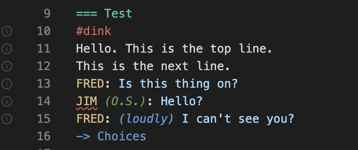

### Character Name Handling

Your cast of characters will be real-time checked against the list for your project, which can be edited in **Project Settings**.

Typed an unrecognised name wrong? Dinky will catch it and offer a quick-fix to add it to the project or correct it.

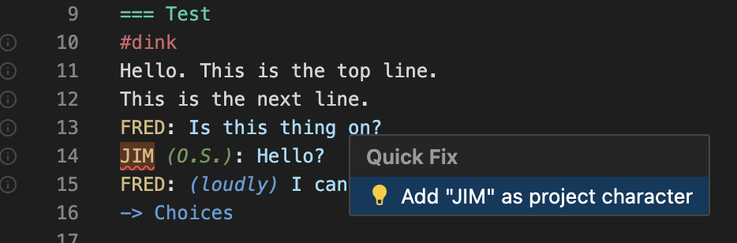

At the beginning of a Dink line, type the `:` key to start an auto-complete - the list of available characters will pop up for you to choose from.

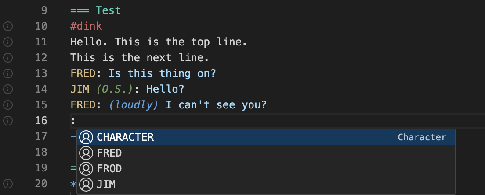

### Line ID Management

Dinky generates an ID for every line of text or choice. It's hidden in the editor, but the saved Ink file has a tag starting #id:&lt;someID&gt;. This is replicating what the **Ink-Localiser** project does (and also the command-line **dink** compiler).

- **Auto-Tagging:** Every line of text or choice is automatically assigned a unique, context-aware ID on save.
- **Contextual Prefixes:** IDs follow the standard format: `Filename_Knot_Stitch_CODE`.
- **Clean Workspace:** ID tags are visually hidden in the editor, represented instead by a small **ID Chip** in the gutter. Roll over it to see the ID.
- **Jump to ID:** Use `Cmd+J` (or `Ctrl+J`) to instantly navigate to any ID across your entire project.
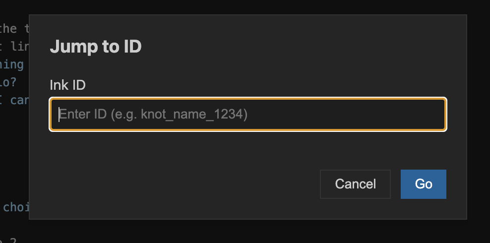
- **One-Click Copy:** Click an ID Chip to copy the ID to your clipboard for use in spreadsheets or game engines.
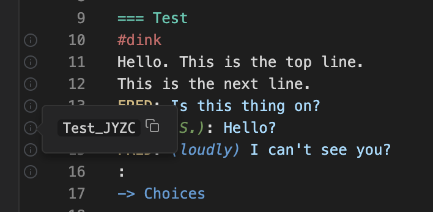

### Dink Compiler Integration

Dinky bundles the the [Dink Compiler](https://github.com/wildwinter/dink); you can compile your project and see the results. It also has an editor for all Dink settings. This means you get features like localisation exports, script stats, recording scripts, audio status, TTS generation, and lots more.

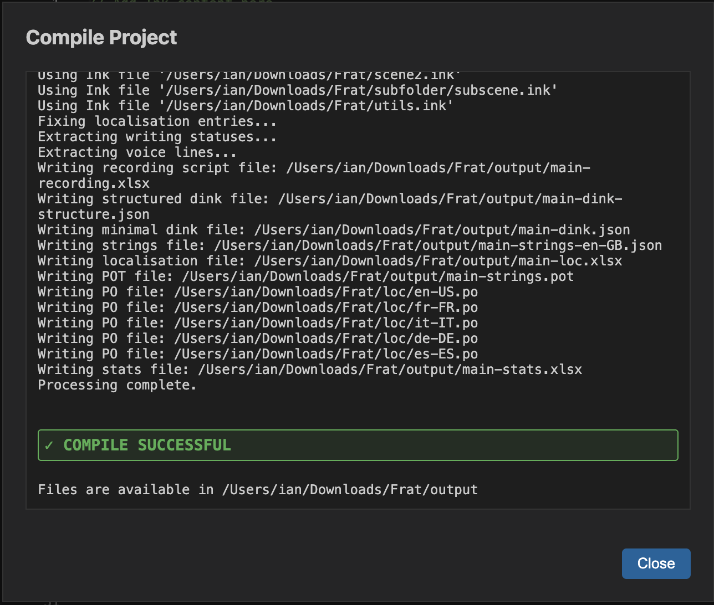

### Additional Features

- **Integrated Test Runner:** Run your story in a dedicated window. Use "Test from Knot" to skip the intro and jump straight to the scene you're working on.
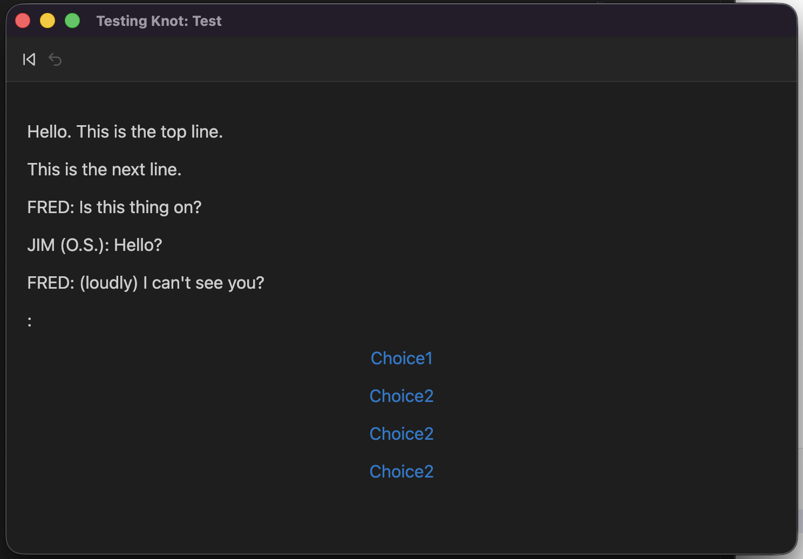
- **Global Search & Replace:** Search and replace across all project files.
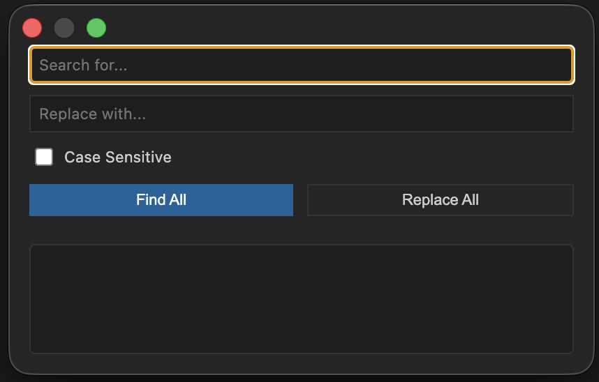
- **Built-in Spellchecker:** Real-time spellchecking with support for project-specific dictionaries - you can add your own terms to the spellchecker. Useful for projects with arcane terms! Currently support US English and UK English.
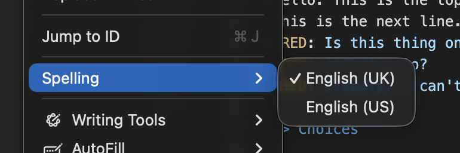
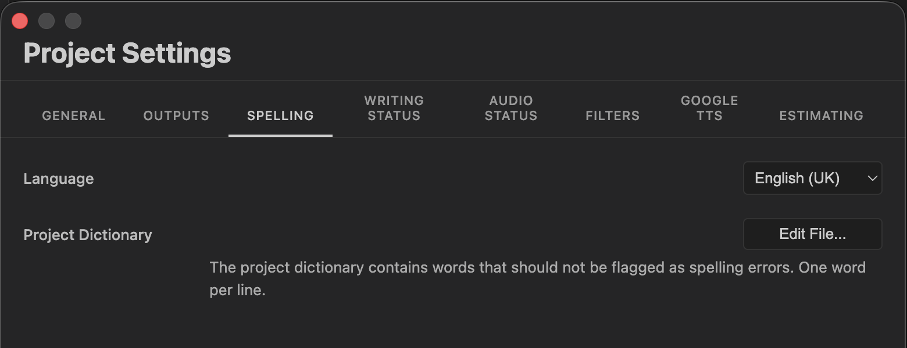
- **Theme:** Supports light, dark, or current system theme!
- **Error Navigation:** Step through the list of errors, including any Ink errors and invalid character names.
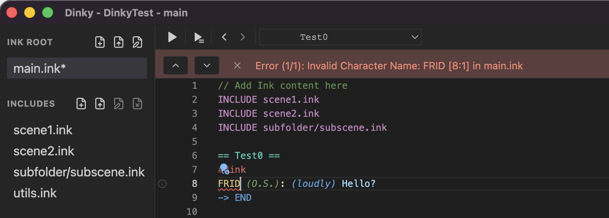
- **Knot/Stitch Navigation:** Go straight to a particular knot or stitch.

- **Export Readable Versions:** Export to PDF, Word, and also interactive HTML, where a reader can explore different sections of the script.

## The ID format

Dinky generates IDs that are stable and descriptive:
`[FileName]_[KnotName]_[StitchName]_[CODE]`

- **Stable:** IDs are preserved once generated.
- **Human-Readable:** You can tell exactly where a line lives just by looking at its ID in a spreadsheet.
- **Collision-Free:** The 4-character random suffix ensures uniqueness even with identical knot names across different files.

## Getting Started

1. **Create a New Project**: Open Dinky and create a `.dinkproj` file.
2. **Define Your Root**: Point Dinky to your main `.ink` file.
3. **Configure Settings**: Set up your project preferences.
4. **Write**: Focus on the story.

## Scratch Audio

## Releases

You can find releases for various platforms [here](https://github.com/wildwinter/dinky/releases).

## Acknowledgements

Dinky is built with **Electron**, **Monaco Editor**, **Inkjs**, and **dink**.

Obviously, huge thanks to [Inkle](https://www.inklestudios.com/) (and **Joseph Humfrey** in particular) for [Ink](https://www.inklestudios.com/ink/) and the ecosystem around it, it's made my life way easier.

## License and Attribution

This is licensed under the MIT license - you should find it in the root folder. If you're successfully or unsuccessfully using this tool, I'd love to hear about it!

You can find me [on Medium, here](https://wildwinter.medium.com/).
