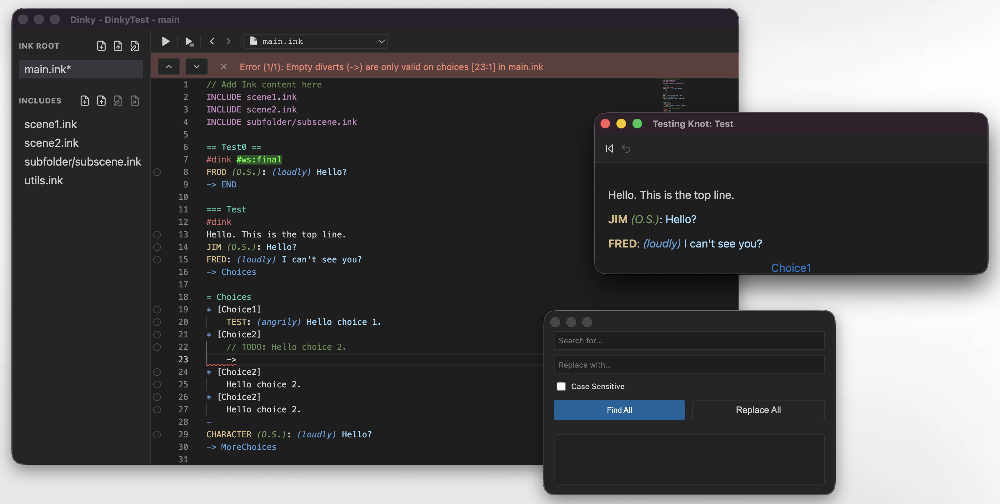
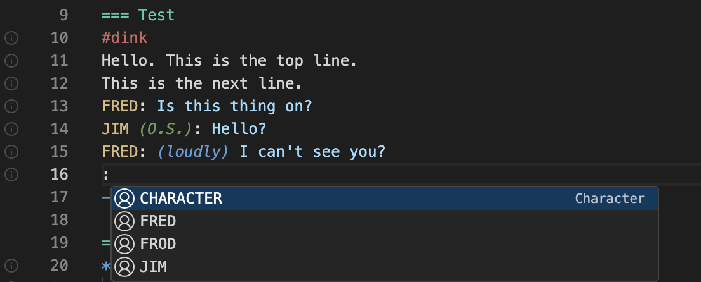
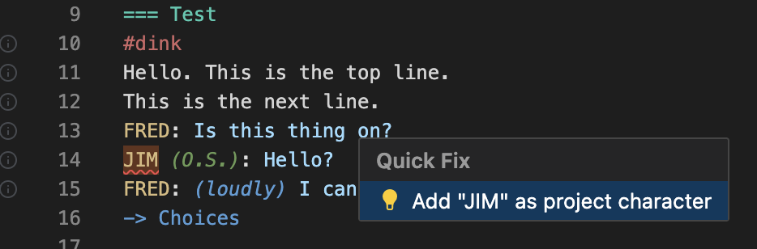
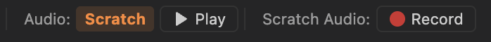
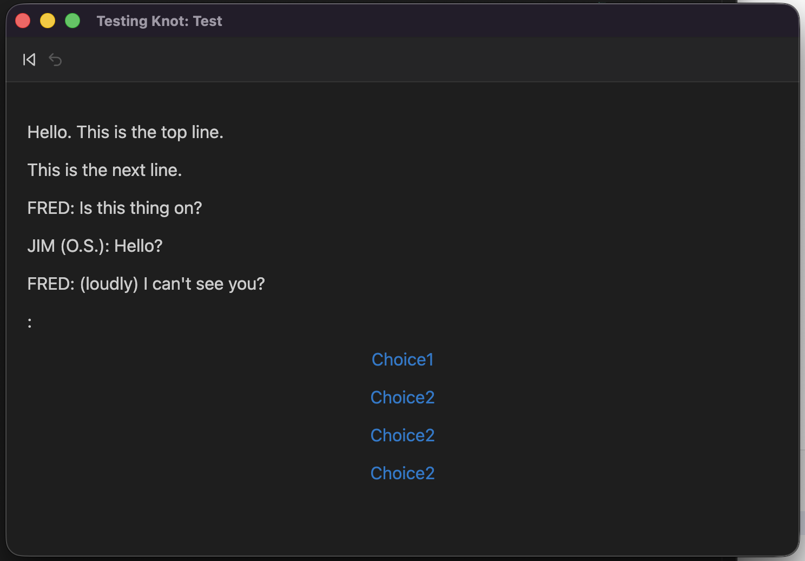
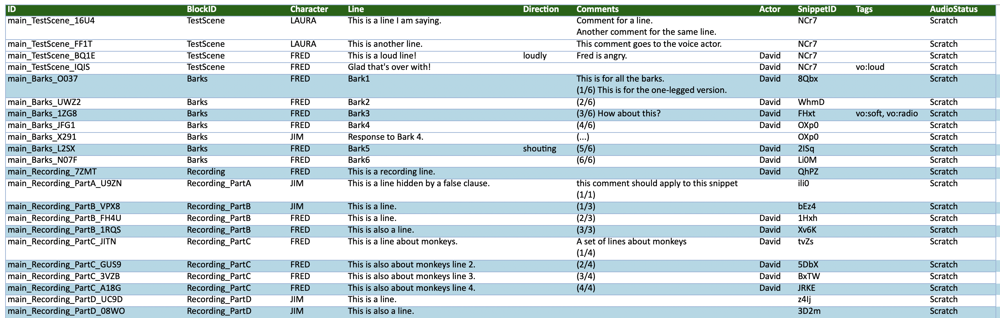
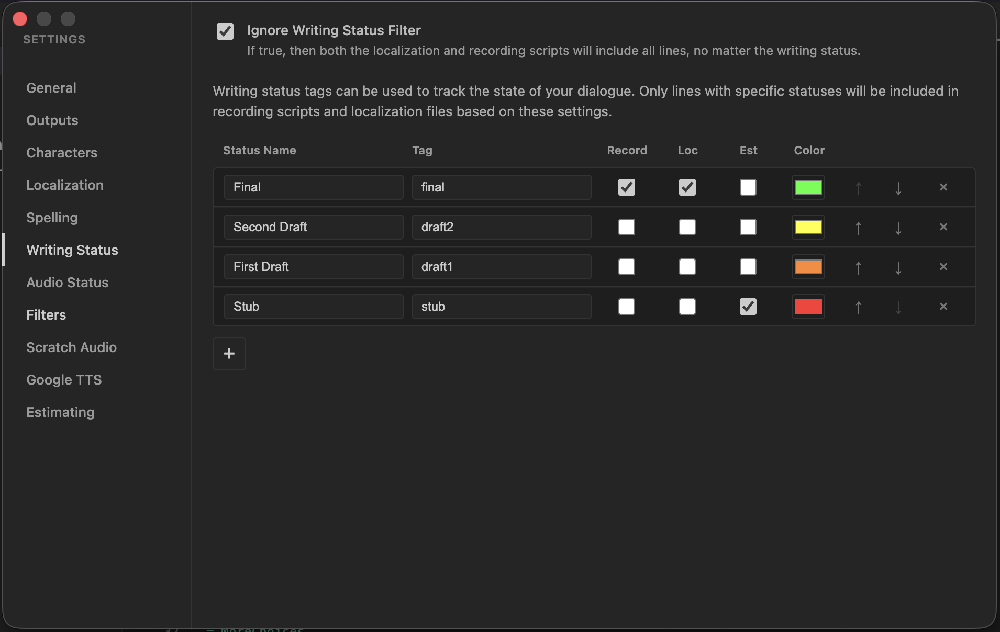

# Dinky

**Dinky** is a specialized IDE for creating and editing **Dink** scripts—a narrative design-focused flavour of Inkle's [Ink](https://www.inklestudios.com/ink/) language.

This doc assumes you are familiar with basic Ink syntax. It focuses on the unique features of Dinky and the **Dink Pipeline** - a set of tools designed to solve the production headaches of modern narrative games: voice recording, localisation, and asset tracking.



## Why Dink?

Ink is fantastic for branching narrative flow, but out of the box, it doesn't separate "dialogue" from "text".

In a complex game production, you need to know:

* **Who** is speaking?
* **How** should they say it? (Direction)
* **What** is the recording status of this line? (Draft, Final, Recorded?)
* **Where** is the audio file for this line?
* **How** do we track this line through localisation without breaking things?

**[Dink](https://github.com/wildwinter/dink)** adds a layer of structure to Ink to answer these questions without losing Ink's flexibility. **Dinky** is the tool that makes writing Dink easy.

---

## Contents

* [Dink Basics](#dink-basics)
* [Using Dinky](#using-dinky)
  * [Interface Overview](#interface-overview)
  * [Character Management](#character-management)
  * [Audio & Scratch Recording](#audio--scratch-recording)
  * [Testing](#testing)
* [The Dink Pipeline & Compiler Artefacts](#the-dink-pipeline--compiler-artefacts)
  * [Runtime Files](#runtime-files)
  * [Production Files](#production-files)
* [Production Workflow](#production-workflow)
  * [Writing Status](#writing-status-ws)
  * [Audio Status](#audio-status)
* [Advanced Project Settings](#advanced-project-settings)
* [Installation & Technical Details](#installation--technical-details)

---

## Dink Basics

**[Dink](https://github.com/wildwinter/dink)**  introduces a specific syntax for dialogue lines, while keeping standard Ink for logic and flow.

### Dialogue Syntax

Inside a knot or stitch or whole file tagged with `#dink`, write dialogue like a screenplay:

```ink
== TheTavern ==
#dink
BARKEEP: What can I get you?
PLAYER: (hesitant) Just a water, thanks.
BARKEEP: A water? In this place?
GUARD (O.S.): Has anyone seen the player?
```

* **Speaker**: Everything before the colon is the speaker.
* **Qualifier** (Optional): Text in parentheses `(O.S.)` is treated as a qualifier for where the voice is coming from. Common in scripts for off-screen or radio etc.
* **Direction** (Optional): Text in parentheses `(hesitant)` is treated as direction for the actor.
* **Text**: Everything after the colon is the line itself.

### Action Lines

Dink also supports "Action Lines" (or "Beats") which are just standard text lines inside a `#dink` block. These are for stage directions or non-dialogue events.

```ink
The Barkeep slams a glass on the counter.
```

### The ID System

The core of the Dink pipeline is the **ID**.

In standard Ink, lines are anonymous. In Dink, **every line gets a unique, stable ID**.

* **Dinky** generates these automatically as you write.
* They are hidden in the editor to keep your workspace clean.
* They look like `#id:TheTavern_Line_AbCd`.

These IDs are the "golden thread" connecting your script to your audio files, localisation spreadsheets, and game engine.

---

## Using Dinky

### Interface Overview

Dinky looks like a standard code editor but is tuned for Dink/Ink.


* **Syntax Highlighting**: Distinguishes between speakers, directions, tags, and logic.
* **ID Chips**: Those small gray pills in the gutter? Those are your Line IDs. Hover to see the full ID, click the ID to copy it. If a line has associated recorded audio, clicking the icon will play the line.
* **Project Settings**: Configure your project, characters, and pipeline rules.

### Character Management

Dinky validates character names in real-time against your project's `characters.json`.

* **Auto-complete**: Type `:` at the start of a line to see a list of valid characters.

* **Quick Fix**: If you type an unknown name, Dinky highlights it. Click the lightbulb to add it to your project or fix a typo.


### Audio & Scratch Recording

Dinky integrates audio directly into the writing process.

* **Scratch Audio**: Record temporary placeholders yourself to test timing and flow.
    1. Click the **Record** button (red circle) in the toolbar.
    2. Speak the line.
    3. Press **Space** to save or **Esc** to cancel.
* **Playback**: Press `Shift+Space` to play the audio for the current line. Dinky will play the "best" available version: Final Studio Recording > Scratch Recording > TTS Placeholder.



### Testing

Use the integrated **Test Runner** to play through your script.

* **Test from Knot**: Jump straight to a knot, skipping the intro.


---

## The Dink Pipeline & Compiler Artefacts

When you hit **Compile** (or run `DinkCompiler`), Dink doesn't just produce a JSON file from the Ink for the runtime. It generates a suite of production assets.

### Runtime Files

These are the files your game engine needs:

1. **`myproject.json`** (Standard Ink JSON)
    * The compiled Ink story.
    * *Crucially:* Text lines can be stripped out, leaving only logic and IDs, reducing memory footprint if you use the separate strings file.

2. **`myproject-dink.json`** (Dink Metadata)
    * Maps every Line ID to its metadata: Speaker, Direction, Mood tags, etc.
    * Your game queries this at runtime: *"Current line ID is `Tavern_01`. Who is speaking? Ah, it's BARKEEP."*

3. **`myproject-strings-en-GB.json`** (Text Content)
    * Separates text from logic. Contains the actual words for every ID.
    * For localisation, you simply load `myproject-strings-fr-FR.json` instead.

### Production Files

These are for your team (Producers, Audio Engineers, Localisation):

1. **`myproject-recording.xlsx`** (The Recording Script)
    * A spreadsheet of every line needing recording.
    * Columns: ID, Character, Actor, Text, Direction, Context Comments.
    * **Filtering**: Only lines marked with "Recordable" status (see below) appear here.
    * **Context**: Automatically notes if a line is an option in a choice, or part of a shuffled set `(1 of 3)`.


2. **`myproject-stats.xlsx`** (Production Dashboard)
    * **Word Counts**: Per output, per character, per scene.
    * **Status Tracking**: How many lines are "Draft"? How many are "Final"? How many are "Recorded"?
    * **Estimates**: If you used placeholder tags (e.g., `#ws:stub`), this shows estimated final counts vs actuals.

3. **`myproject-loc.xlsx`** or **`.po` files** (Localisation)
    * Dink supports both Excel-based and standard PO/POT localisation workflows.
    * Includes speaker names and context notes to help translators.

---

## Production Workflow

### Writing Status (`#ws`)

Track the maturity of your script using tags. Configure these in **Project Settings**.

* `#ws:stub` - Just a placeholder.
* `#ws:draft` - Needs review.
* `#ws:final` - locked for recording.

Propagate status hierarchy:

```ink
== ChapterOne ==
#dink
#ws:draft
... (all lines here are Draft) ...

= TheEnding
#ws:final
... (except these lines, which are Final) ...
```

### Audio Status

Dink tracks your audio asset pipeline by checking folders defined in your settings.

* If a file named `Tavern_01.wav` exists in `Audio/Final/`, status is **Final**.
* If in `Audio/Scratch/`, status is **Scratch**.
* If missing, status is **Missing**.

This feeds directly into the **Stats** file, so you instantly see "We have recorded 45% of the Barkeep's lines."

## Advanced Project Settings

The **Project Settings** dialog allows you to configure Dinky's behaviour. It is organized into several tabs:



### General

* **Output Folder**: The destination directory for all compiled artifacts (`.json`, `.xlsx`, etc.).
* **Include Debug Text**: If checked (`nostrip` setting), the compiled Ink JSON will retain the original text lines. This is useful for debugging but increases the file size.

### Outputs

Control which files are generated when you compile.

* **Output Recording Script**: Generates the Excel spreadsheet for voice actors.
* **Output Dink Structure**: Generates a JSON file describing the scene/beat structure (useful for tools).
* **Output Stats Spreadsheet**: Generates the comprehensive status report.

### Characters

Define the cast of your game.

* **Script Name**: The name used in your Ink script (e.g. `BARKEEP`).
* **Actor**: The name of the real-world actor (e.g. `Jane Doe`). This appears in the Recording Script.

### Localization

* **Output Localization Spreadsheet**: Generates an Excel file for translation.
* **Default Locale Code**: The code for your source language (e.g. `en-GB`).
* **Localize Actions**: If checked, "Action" lines (stage directions) are included in the export.
* **PO/POT Export**:
  * **Output Pot File**: Generates a `.pot` template.
  * **PO Folder**: Where `.po` files are stored.
  * **PO Languages**: Comma-separated codes (e.g. `fr-FR, de-DE, ja-JP`) for target languages.

### Spelling

* **Language**: Select the dictionary for the editor's spellchecker (English UK/US are supplied).
* **Project Dictionary**: Add your own made-up words here so they aren't flagged as errors.

### Writing Status

Manage the `#ws:` tags used to track script progress.

* **Ignore Writing Status Filter**: If checked, *all* lines are exported to recording/localisations scripts, regardless of their status.
* **Status List**: Define tags like `#ws:draft`, `#ws:final`.
  * **Record**: Include lines with this status in the recording script?
  * **Loc**: Include lines with this status in the localization kit?
  * **Est**: Use this status for estimates? (See *Estimating* tab).
  * **Color**: The highlight color used in the Stats spreadsheet.

### Audio Status Settings

Define where Dinky looks for audio files to track progress.

* Map folders (e.g. `Audio/Final`) to statuses (e.g. `Final`).
* **Recorded**: If checked, lines found in this folder count as "Complete" in the stats.

### Filters

"The Esoteric Stuff" - precise control over what gets exported.

* **Localization Comments**: Dictionary of comment prefixes that should be sent to translators (e.g. `LOC`, `TRANS`). `?` includes comments with no prefix.
* **Recording Comments**: Dictionary of comment prefixes that should go to the studio (e.g. `VO`, `DIR`).
* **Recording Tags**: Specific `#tags` to export to the recording script (e.g. `vo` to capture `#vo:loud`).

### Scratch Audio

* **Enable Scratch Audio**: Turns on the recording feature in the editor.
* **Output to Audio Status**: Which audio status folder should new scratch recordings be saved to?
* **Audio Format**: WAV or OGG.

### Google TTS

* **Generate TTS**: If checked, Dinky generates placeholder audio on compile.
* **Key File**: Your Google Cloud Service Account JSON key.
* **Output to Audio Status**: Which folder to save TTS files in.
* **Character Voices**: Map your characters to specific Google Cloud TTS voice IDs.

### Estimating

* **Tag / Lines**: Define estimates for specific tags.
  * Example: Tag `conversation` = `50` lines.
  * If a scene is marked with an "Estimate" writing status (e.g. `#ws:stub`) and has the tag `#conversation`, the stats report will use your estimated count (50) instead of the actual line count. Great for tracking progress on unwritten scenes.

---

## Installation & Technical Details

### Getting Dinky

You can find the latest release of Dinky on GitHub:
**[Dinky Releases](https://github.com/wildwinter/dinky/releases)**

### Note on Windows Security

Because this is a hobbyist project, this app is **currently not digitally signed*** for Windows. When you run the installer, Windows may show a blue "Windows protected your PC" box.

To install anyway:

1. Click "**More info**" on the blue popup.

2. Click "**Run anyway**".

Alternatively, you can right-click the .exe, select Properties, check the Unblock box at the bottom, and click OK.

For more details on why Windows shows this, see the [Official Microsoft SmartScreen Documentation](https://learn.microsoft.com/en-us/windows/security/operating-system-security/virus-and-threat-protection/microsoft-defender-smartscreen/).

\* *Because it costs a lot and seems to be impossible outside North America right now for individual developers. Thanks Microsoft!*

### Note on Mac Security

The app is signed. Because it's easier on Mac.

## Acknowledgements

Dinky is built with **Electron**, **Monaco Editor**, **Inkjs**, and **dink**.

Obviously, huge thanks to [Inkle](https://www.inklestudios.com/) (and **Joseph Humfrey** in particular) for [Ink](https://www.inklestudios.com/ink/) and the ecosystem around it, it's made my life way easier.

## License and Attribution

This is licensed under the MIT license - you should find it in the root folder. If you're successfully or unsuccessfully using this tool, I'd love to hear about it!

Third-party licenses for bundled components (dictionaries, Dink compiler, and npm dependencies) are documented in [THIRD_PARTY_LICENSES.md](THIRD_PARTY_LICENSES.md).

You can find me [on Medium, here](https://wildwinter.medium.com/).
